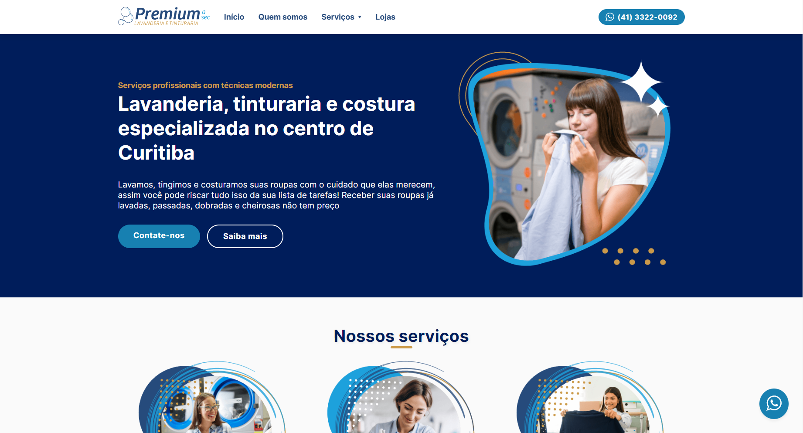
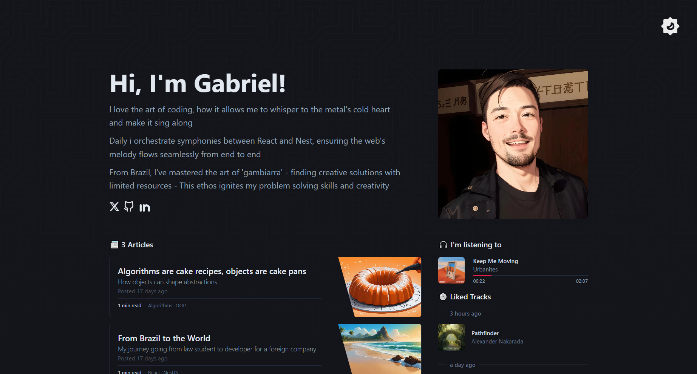
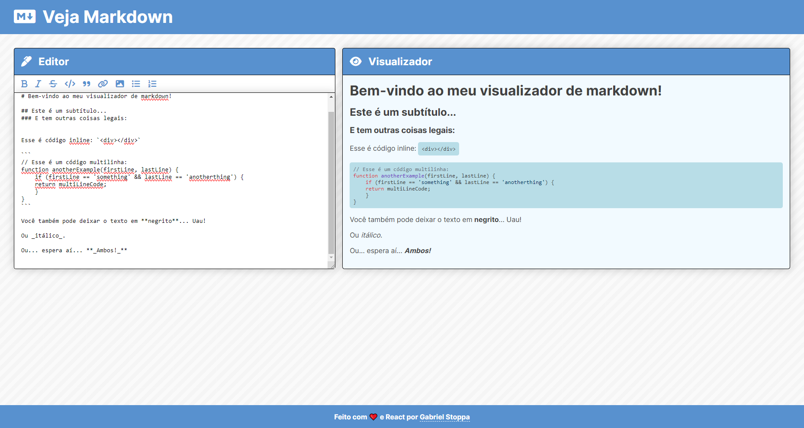
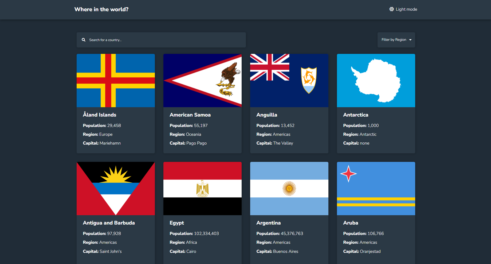

<h1>Hi, i'm Gabriel! 👋</h1>
<h3>A little about me <a href="https://github.com/Arquimidio/Arquimidio/blob/main/README-PT.md">(Ver em português)</a></h3>

🧑‍💻 I'm a Full Stack Developer from Brazil

🌎 I'm currently studying for a Software Engineer degree while doing my projects

🎓 I have a Bachelor of Laws degree

📚 I've been studying Web Development since 2021 (and i don't want to stop anymore lol)

💪 I've reached top 1% at <a href="https://www.codewars.com/users/Arqui_" target="_blank">CodeWars</a> during 2022, with more than 1000 solved code challenges

🔎 I'm an expert at searching on Google

🎶 <a href="https://www.youtube.com/watch?v=XBVWALD96zE&t=961s">This</a> is, no doubt, the best playlist to code!

  
  

<h1>My main projects</h1>
<table bordercolor="#66b2b2">
   <tr>
        <td width="50%" valign="top">
            
           <h3>Premium a sec</h3>
        

      

        
<strong>HTML, CSS, JavaScript, Node, Express, EJS </strong> - Official Premium a sec Laundry Website!

          
    </td>
    <td width="50%" valign="top">
      
      <h3>Entropy</h3>
      

    

      
<strong>HTML, CSS, JavaScript, JSX, React</strong> - Edit your markdown and watch your changes in real time!

          

  </td>
    </tr>
   <tr> 
    <td width="50%" valign="top">
        
        <h3>Veja Markdown</h3>
        

      

        
<strong>HTML, CSS, JavaScript, JSX, React</strong> - Edit your markdown and watch your changes in real time!

            
  
    </td>
    <td width="50%" valign="top">
      
           <h3>Where in the world?</h3>
        

      

        
<strong>HTML, CSS, JavaScript, JSX, React e React Router</strong> - Search for information about lots of countries in the world!

          
  
    </td>
  </tr>
  <tr>
         <td width="50%" valign="top">
      
        <h3>Shortly</h3>
        

      

        
<strong>HTML, CSS, JavaScript, NodeJS, Express, Mongoose</strong> - Shorten your links to be able to share them easily!

      
  
    </td>
    <td width="50%" valign="top">
      

<h3>My Library</h3>  

<strong>HTML, CSS, JavaScript</strong> - Register your readings and see your progress with a beautiful interface!

  
  
      

    </td>
  </tr>
</table>
